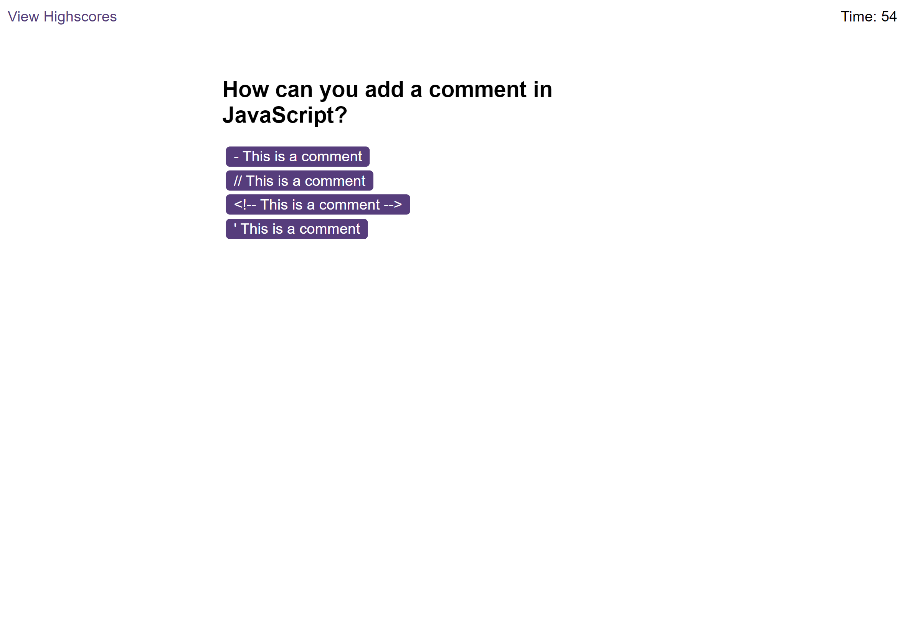
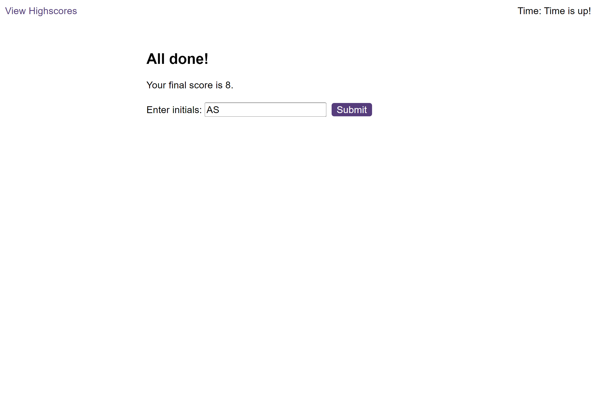

# JavaScript Quiz

This [webpage](https://amikerb.github.io/JavaScript-Quiz/index.html) allows the user to test their JavaScript knowledge with a JavaScript quiz. When the "Start Quiz" button in clicked the timer begins and the user is presented with the first question. The questions will appear in a random order, with the answer choices also appearing in a random order. When the correct answer is clicked the next question appears. If the user clicks the wrong answer "wrong" appears underneath the choices and the time decreases by 10 seconds. The game is over once all the questions are answered or the timer reaches 0. Then a game over page appears showing the users quiz score and an input box for the user to type their initials and submit them. One the main webpage page there is a button which takes the user to the Highscores, this page shows the top 5 highest scores with the users initials. There is a button to clear the scores which also clears the scores in the local storage. 

## Usage 

### Screenshot of wepage on a desktop:

#### screenshot of question:

#### screenshot of end page:

## Credits 

- [w3schools Quiz JavaScript](https://www.w3schools.com/quiztest/quiztest.asp?qtest=JS) for quiz questions
- [stackoverflow](https://stackoverflow.com/questions/1933969/sound-effects-in-javascript-html5) forum for how to play sfx
- [Fisher-Yates Shuffle](https://stackoverflow.com/questions/2450954/how-to-randomize-shuffle-a-javascript-array) on stackoverflow
- [.this](https://developer.mozilla.org/en-US/docs/Web/JavaScript/Reference/Operators/this) on mdn web docs
- [.remove()](https://developer.mozilla.org/en-US/docs/Web/API/Element/remove) on mdn web docs
- [setTimeout()](https://www.w3schools.com/jsref/met_win_settimeout.asp) on w3school
- [JavaScript Quiz ending before all questions asked](https://stackoverflow.com/questions/70730474/javascript-quiz-ending-before-all-questions-asked) on stackoverflow